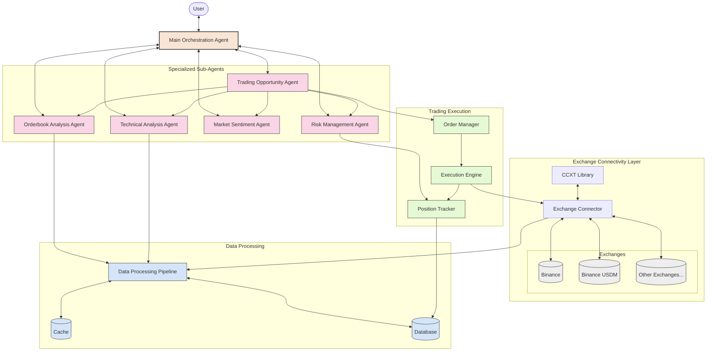

# Crypto Market Analysis Agent System Architecture

## Component Descriptions

### User Interface
- Entry point for user interactions with the system
- Accepts natural language queries and commands
- Displays analysis results, trading opportunities, and execution reports

### Main Orchestration Agent
- Central coordinator for the entire system
- Interprets user requests and routes to appropriate specialized agents
- Combines insights from multiple agents for comprehensive responses
- Manages handoffs between agents based on context and needs

### Specialized Sub-Agents
- **Orderbook Analysis Agent**: Analyzes market depth and liquidity across exchanges
- **Technical Analysis Agent**: Performs technical analysis on price data and generates insights
- **Trading Opportunity Agent**: Identifies trading opportunities and generates signals
- **Market Sentiment Agent**: Analyzes sentiment from various sources to gauge market psychology
- **Risk Management Agent**: Evaluates portfolio risk and suggests position sizing

### Exchange Connectivity Layer
- **CCXT Library**: Provides standardized interfaces to cryptocurrency exchanges
- **Exchange Connector**: Manages connections, API rate limits, and error handling
- **Exchanges**: Multiple cryptocurrency exchanges accessible through CCXT

### Data Processing
- **Data Processing Pipeline**: Collects, normalizes, and processes market data
- **Cache**: Temporary storage for frequently accessed data to reduce API calls
- **Database**: Persistent storage for historical data, analysis results, and configurations

### Trading Execution
- **Order Manager**: Processes trading signals and prepares orders
- **Execution Engine**: Submits orders to exchanges and monitors execution
- **Position Tracker**: Tracks open positions, portfolio value, and performance metrics

## Data Flow

1. User submits a request to the Main Orchestration Agent
2. Main Agent interprets the request and delegates to appropriate specialized agents
3. Specialized agents request necessary data from the Data Processing Pipeline
4. Data Pipeline retrieves data from Cache or requests fresh data via Exchange Connector
5. Exchange Connector communicates with exchanges through the CCXT library
6. Specialized agents perform their analyses and return results to the Main Agent
7. If trading is involved, Trading Opportunity Agent generates signals for Order Manager
8. Order Manager creates appropriate orders and passes to Execution Engine
9. Execution Engine submits orders to exchanges and updates Position Tracker
10. Main Agent synthesizes all information and provides a response to the User
